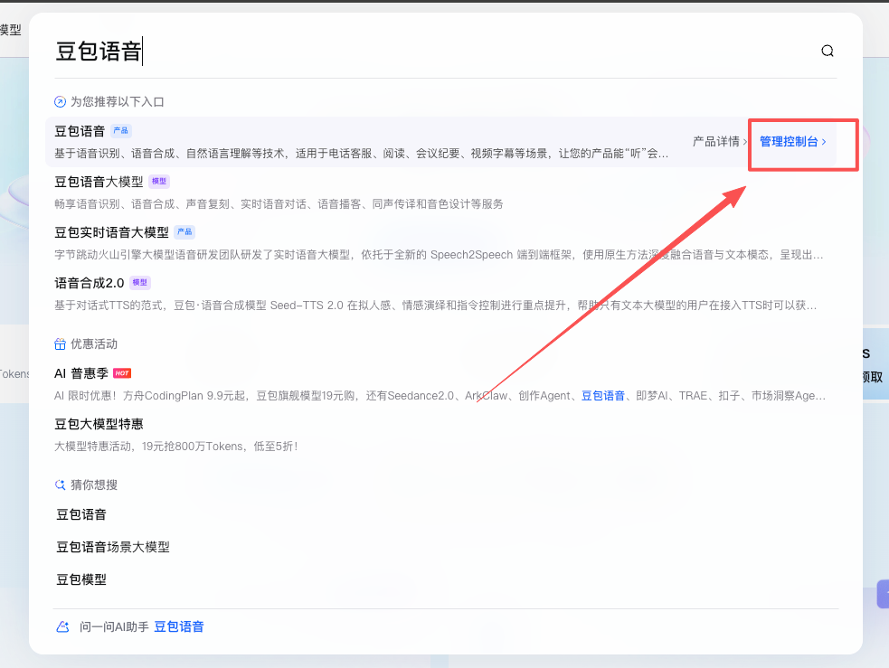
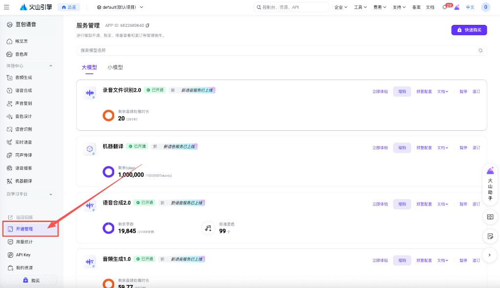
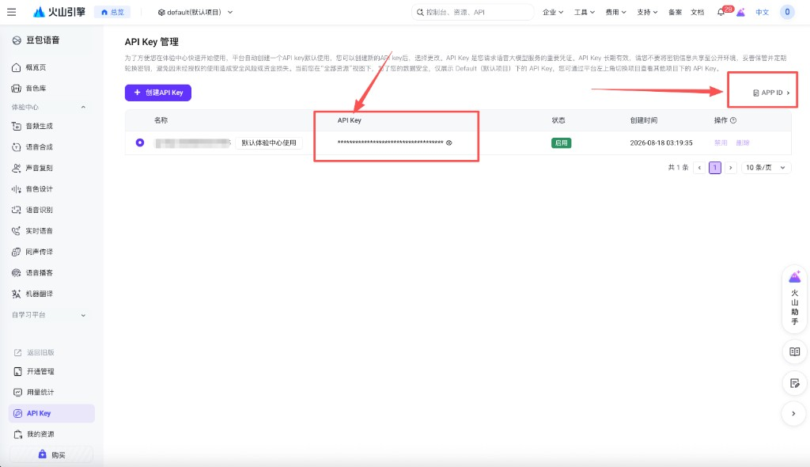

# AWECommentAudioTweak 详细使用说明

基于豆包语音，将抖音评论区录音合成为指定 AI 音色并发送。

## 相对上一版（v1.0.0）

**最大变化：不用反复打字合成。**

上一版每次想用 AI 音色，都要打开合成页重新输入文字、点合成，再去发语音。

现在选好音色，打开「录音转音色」，评论区和平时一样点麦克风说话，发出去就是当前选中的 AI 音色。失败则保留原声。

「输入文字合成」仍可用，适合固定文案或不想开口时，不再是主路径。

**其它相对上一版**

- 入口改为评论顶栏波形按钮；不再用输入栏旁的云朵，也不再长按麦克风开面板
- 界面改为「合成 / 本地」分页，跟随抖音深浅色；底部 GitHub / Telegram / API
- 只保留豆包语音 2.0，去掉千问；凭证改为 App ID + API Key
- 仍可长按语音评论保存、本地导入收藏

## 目录

- [相对上一版（v1.0.0）](#相对上一版v100)
- [安装与注入](#安装与注入)
- [打开设置面板](#打开设置面板)
- [语音下载](#语音下载)
- [音频替换](#音频替换)
- [合成](#合成)
- [本地](#本地)
- [获取 App ID 和 API Key](#获取-app-id-和-api-key)
- [常见问题](#常见问题)

---

## 安装与注入

### 环境要求

- iOS 15.0 或更高版本
- 已安装 TrollStore（巨魔商店）
- macOS 上配置好 Theos 编译环境

### 编译

```bash
make
```

编译产物在项目根目录的 `AWECommentAudioTweak.dylib`。

### 注入

1. 将 `AWECommentAudioTweak.dylib` 传到 iPhone
2. 打开 TrollTools，选择抖音
3. 注入 dylib
4. 重启抖音

---

## 打开设置面板

打开任意视频评论区，点顶栏波形按钮（关闭按钮旁）进入设置。界面跟随抖音浅色 / 深色。下滑关闭。

面板顶部两个分页：**合成**、**本地**。底部三个入口：**GitHub**、**Telegram**、**API**。

打开「录音转音色」后，评论输入栏的麦克风和平时一样点按说话，发出去就是当前 AI 音色。固定文案再用面板里的「输入文字合成」。不要用抖音自带的 AI 合成页。

---

## 语音下载

播放一条语音评论后长按，弹出保存对话框。保存后从 CDN 下载到沙盒目录 `AWECommentAudio/`。

文件命名：`评论ID_时长ms.m4a`

---

## 音频替换

开启替换后，评论区录制的语音会被换成你选定的音频，对方听到的是选定内容。

关闭替换：在「本地」里关闭当前替换即可。

---

## 合成

豆包语音合成 2.0。

- **录音转音色**：选好音色后打开此项，评论区正常点麦克风说话即可合成；失败则保留原声
- 点音色头像或名称更换音色，点「试听」预览
- 语速、音量、音调、句尾静音
- 语气：例如「用轻松的语气说」
- 方言：东北 / 陕西 / 四川，仅 **Vivi 2.0** 可用；其它音色会提示不可用
- **输入文字合成**：备用，输入文字生成语音并设为替换音频

---

## 本地

- 收藏常用音频，点选即设为替换
- 本机导入音频或 zip，自动解压、转码
- 浏览插件目录 `AWECommentAudio/`

---

## 获取 App ID 和 API Key

插件只用火山引擎 **豆包语音**。凭证填在设置面板底部 **API**。

### 1. 登录火山引擎

打开 [火山引擎控制台](https://console.volcengine.com/)，登录账号。进去随便充 10 块钱；如果有送额度就不用充。

### 2. 搜索「豆包语音」，进控制台

顶栏点击搜索，搜 **豆包语音**，点右侧 **管理控制台**。



### 3. 开通管理

进去以后看左侧边栏，点击 **开通管理**。不知道开哪个 AI 模型就全开。合成至少需要 **语音合成 2.0**；录音转音色还需要语音识别。



### 4. 创建 API Key，填进插件

再看左侧边栏，点 **API Key**，创建后复制：

- 表格里的 **API Key**
- 右上角 **APP ID >**，复制 App ID



回到抖音，打开插件面板，点底部 **API**，把 App ID 和 API Key 粘贴进去即可。

---

## 常见问题

### Q: 找不到波形按钮？

A: 先打开评论区，看顶栏关闭按钮旁边。确认 dylib 已注入并重启过抖音。

### Q: 合成失败？

A: 检查底部 API 里 App ID、API Key 是否填对；控制台「开通管理」里 **语音合成 2.0** 是否已开通；账号是否有额度。

### Q: 方言点了没效果？

A: 方言只对 **Vivi 2.0** 生效。换成其它音色会提示不可用，也不会把方言发给接口。

### Q: 录音转音色失败，原声没了？

A: 失败会保留原声。确认已开通识别相关模型，并已填写 API。

### Q: 导入的音频在哪？

A: `AWECommentAudio/导入音频/`，可在「本地」里的插件目录浏览。

---

## 作者

[@cookieodd](https://github.com/cookieodd) · [Telegram](https://t.me/cookieodd)
