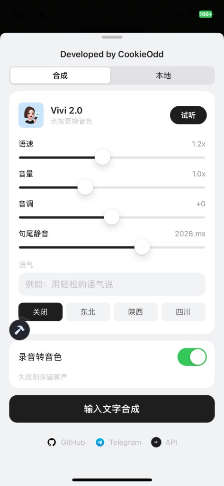
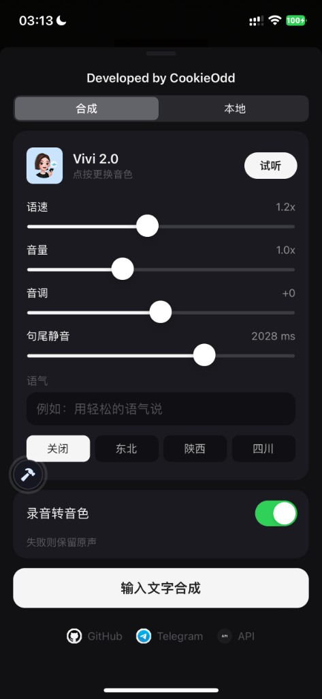

# AWECommentAudioTweak

基于豆包语音，将抖音评论区录音合成为指定 AI 音色并发送。

## 相对上一版（v1.0.0）

**最大变化：不用反复打字合成。**

上一版每次想用 AI 音色，都要打开合成页重新输入文字、点合成，再去发语音。

现在选好音色，打开「录音转音色」，评论区和平时一样点麦克风说话，发出去就是当前选中的 AI 音色。失败则保留原声。

「输入文字合成」仍可用，适合固定文案或不想开口时，不再是主路径。

**其它相对上一版**

- 入口改为评论顶栏波形按钮；不再用输入栏旁的云朵，也不再长按麦克风开面板
- 界面改为「合成 / 本地」分页，跟随抖音深浅色；底部 GitHub / Telegram / API
- 只保留豆包语音 2.0，去掉千问；凭证改为 App ID + API Key
- 仍可长按语音评论保存、本地导入收藏

## 功能

- **录音转音色**：正常点麦克风说话，直接合成当前 AI 音色；失败则保留原声
- 评论区顶栏波形按钮打开设置面板，界面跟随抖音浅色 / 深色
- **合成**：豆包语音合成 2.0，更换音色、试听，调节语速、音量、音调、句尾静音，可填语气词
- **方言**：东北 / 陕西 / 四川，仅 **Vivi 2.0** 可用
- **输入文字合成**：备用，输入文字生成语音并设为替换音频
- **本地**：收藏、本机导入、插件目录浏览
- 长按语音评论即可保存到本地

## 界面

| 浅色 | 深色 |
|:---:|:---:|
|  |  |

底部三个入口：**GitHub**、**Telegram**、**API**。下滑即可关闭面板。

## 使用方法

1. 编译：`make`
2. 用 TrollTools 把 `AWECommentAudioTweak.dylib` 注入抖音
3. 打开任意视频评论区，点顶栏波形按钮进入设置
4. 先按下方步骤配置 App ID 和 API Key
5. 在「合成」里选好音色，打开「录音转音色」
6. 回到评论区，和平时一样点麦克风说话即可发出 AI 音色；也可切到「本地」选已有音频，或用「输入文字合成」生成固定文案

## 获取 App ID 和 API Key

插件只用火山引擎 **豆包语音**，在面板底部点 **API** 填写。

### 1. 登录火山引擎

打开 [火山引擎控制台](https://console.volcengine.com/)，登录账号。进去随便充 10 块钱；如果有送额度就不用充。

### 2. 搜索「豆包语音」，进控制台

顶栏点击搜索，搜 **豆包语音**，点右侧 **管理控制台**。

### 3. 开通管理

进去以后看左侧边栏，点击 **开通管理**。不知道开哪个 AI 模型就全开。插件合成至少需要 **语音合成 2.0**；录音转音色还需要语音识别。

### 4. 创建 API Key，填进插件

再看左侧边栏，点 **API Key**，创建后复制：

- 表格里的 **API Key**（点眼睛可显示完整内容）
- 右上角 **APP ID >**，复制 App ID

回到抖音，打开插件面板，点底部 **API**，把 App ID 和 API Key 粘贴进去即可。

## 环境要求

- iOS 15.0+
- Theos 编译环境
- TrollTools 注入

## 作者

[@cookieodd](https://github.com/cookieodd) · [Telegram](https://t.me/cookieodd)
