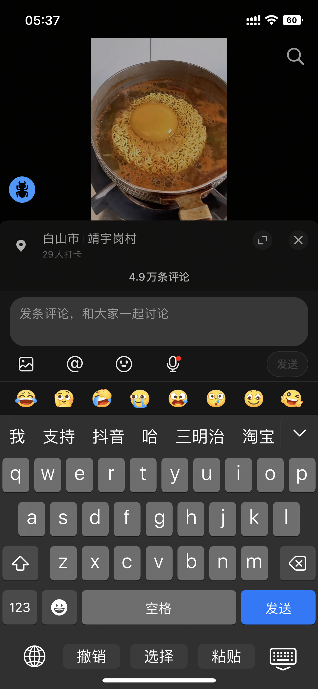
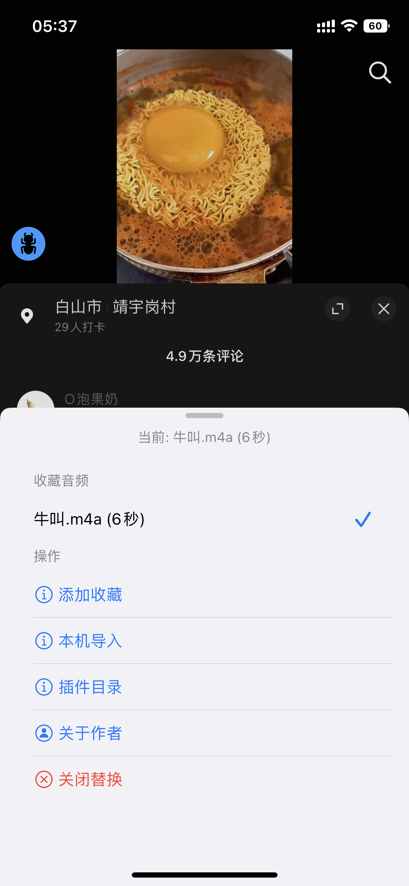
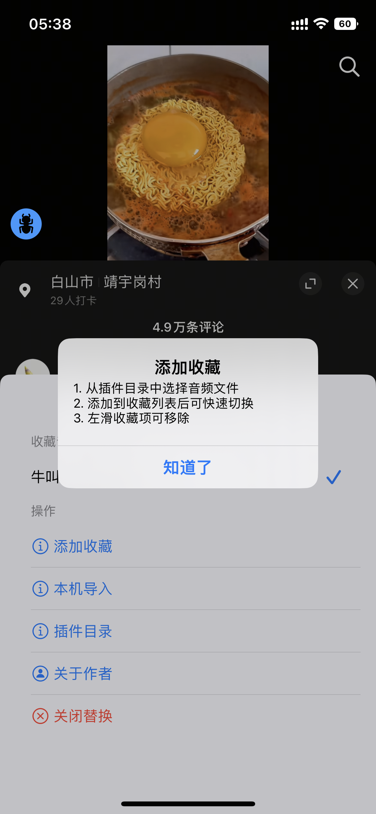
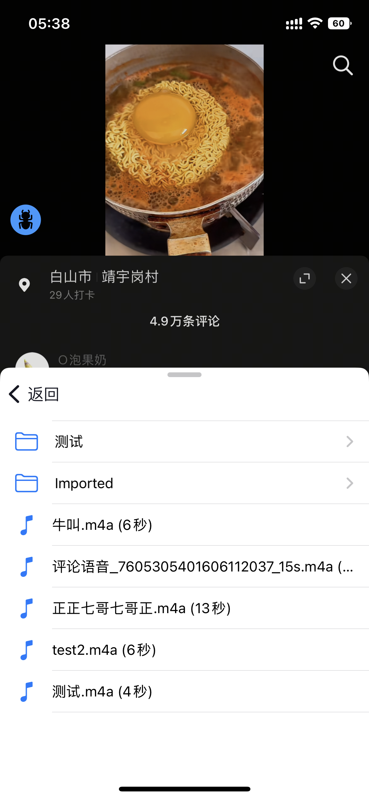
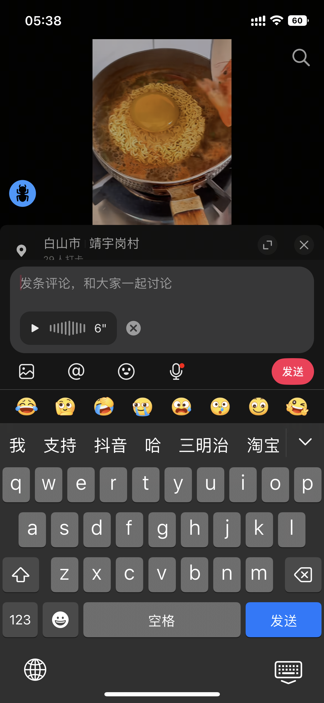

# AWECommentAudioTweak

抖音评论区语音下载 & 录制替换插件。

## 功能

- 长按语音评论弹出保存对话框，从 CDN 直链下载语音文件
- 语音按钮长按打开音频选择面板，选择替换音频后发送语音自动替换
- 收藏夹管理，快速切换常用音频
- 支持本机导入音频/zip，自动解压和转码
- 插件沙盒目录浏览，按文件夹分类管理
- 替换状态红点提示，导航栏显示当前替换音频

## 截图

| 长按保存 | 替换状态 | 选择面板 |
|:---:|:---:|:---:|
|  |  |  |

| 收藏说明 | 插件目录 | 替换成功 |
|:---:|:---:|:---:|
|  |  |  |

## 使用方法

1. 编译 dylib：`make -C AWECommentAudioTweak`
2. 通过 TrollTools 注入抖音
3. 播放一条语音评论后长按即可保存
4. 长按评论输入栏的语音按钮打开选择面板
5. 选择音频后发送语音评论即自动替换语音内容

## 环境要求

- iOS 15.0+
- Theos 编译环境
- TrollTools 注入

## 作者

[@cookieodd](https://github.com/cookieodd) | [Telegram](https://t.me/cookieodd)
